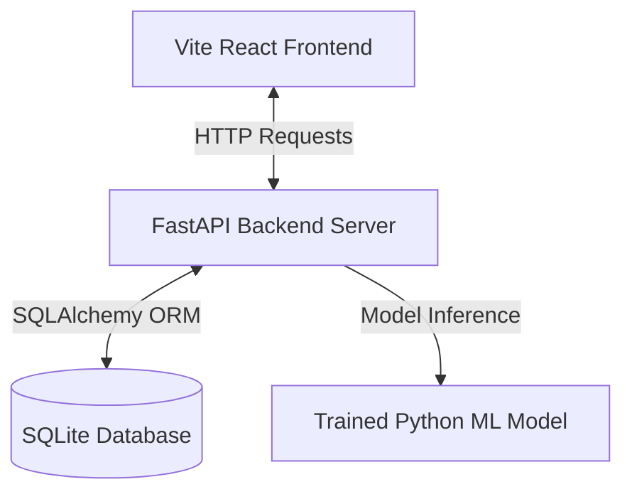

# MetroFlow AI 🚦 (Tamil Nadu State Traffic Twin & Predictor)

**MetroFlow AI** is a full-stack, AI-powered traffic simulation and congestion forecasting dashboard. It models major national highway corridors and district nodes of **Tamil Nadu, India** (Chennai, Vellore, Coimbatore, Salem, Trichy, Madurai, and Tirunelveli).

The application features a responsive React dashboard, an active stochastic simulation engine, a Python FastAPI backend, a SQLite database, and a machine learning predictor that runs real-time congestion forecasts.

---

## 🏗️ System Architecture



* **Frontend:** Built with React, TypeScript, Vite, Recharts (data plotting), Lucide Icons, and styled using modern, high-fidelity glassmorphism.
* **Backend:** Async Python FastAPI serving database endpoints, ML prediction interfaces, and TomTom API proxies.
* **Database:** SQLite (`server/traffic.db`) utilizing SQLAlchemy to store telemetry records and incident states.
* **Machine Learning:** Random Forest Regressor trained on custom traffic simulation variables (weather, event densities, active policy counts, time of day, incidents) to predict grid efficiency.

---

## ✨ Features

- **Tamil Nadu Highway Map:** A vector-rendered coordinate grid representing major corridors like NH 45, NH 48, NH 544, and NH 7.
- **Dynamic Speed Simulation:** Simulates vehicle speeds based on Volume-to-Capacity (V/C) ratios, signal cycles, weather, and blockages.
- **Stochastic Spawner:** Generates random highway incidents (accidents, construction, breakdowns) which are written to the database.
- **AI Policy Toggles:** Activate Dynamic Signals, Smart Rerouting, or Ramp Metering to recalculate traffic loads.
- **Database Telemetry:** Logs global congestion data to SQLite and charts historical trend curves with Recharts.
- **ML Predictions:** Contacts the FastAPI prediction server to run Random Forest model forecasts when variables change.

---

## 🚀 Quick Start Guide

### Prerequisites
- Python 3.9+
- Node.js 18+

### 1. Setup the Backend Server
1. Navigate to the project root directory.
2. Install Python dependencies:
   ```bash
   pip install -r server/requirements.txt
   ```
3. Train the Machine Learning model:
   ```bash
   python server/train.py
   ```
   *This generates the `server/model.pkl` forecast weights.*
4. Start the FastAPI server:
   ```bash
   python server/main.py
   ```
   *The server starts listening on `http://127.0.0.1:8000`.*

### 2. Setup the Frontend Client
1. Open a new terminal in the project root.
2. Install npm packages:
   ```bash
   npm install
   ```
3. Start the Vite React development server:
   ```bash
   npm run dev
   ```
4. Open your browser and navigate to **`http://localhost:5173`**.

---

## 🗄️ Database Management Scripts

Manage the database directly using `npm` script shortcuts:

- **Seed logs database:**
  ```bash
  npm run db:seed
  ```
  *Seeds the database tables with 100 historical logs simulating a 24-hour traffic cycle.*

- **Export database to CSV:**
  ```bash
  npm run db:export
  ```
  *Exports all telemetry logs to `server/traffic_history_export.csv`.*

- **Reset database:**
  ```bash
  npm run db:clear
  ```
  *Clears and resets all database tables.*
